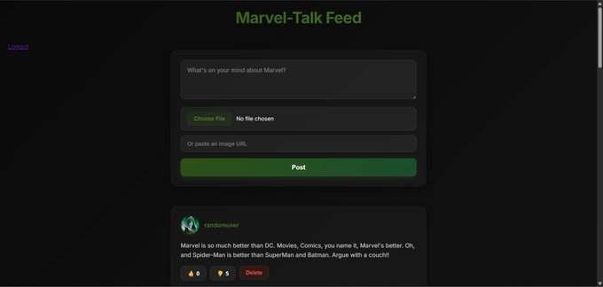

# Marvel-Talk

A full-stack web application inspired by Bluesky, that allows users to **sign up, log in, and have  interactive conversations about Marvel on a timeline feed!**. 
 
Users can also delete their own posts on the feed as well!

## Tech Stack

- **Backend:** Node.js, Express.js 
- **Database:** MongoDB with Mongoose  
- **Authentication:** Passport.js
- **Frontend:** EJS templating, HTML, CSS, and Multer for uploading files!

## Lessons Learned:

- Learned how to utilize Multer for uploading files
- Learned how to build a timeline feed for all the posts to live on!
- Learned how to integrate an authentication system for all users
- Learned how to setup my schema for Posts, and Users

## Image of Project:

[Live Link](https://marvel-talk.up.railway.app/)
